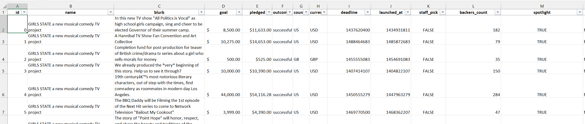
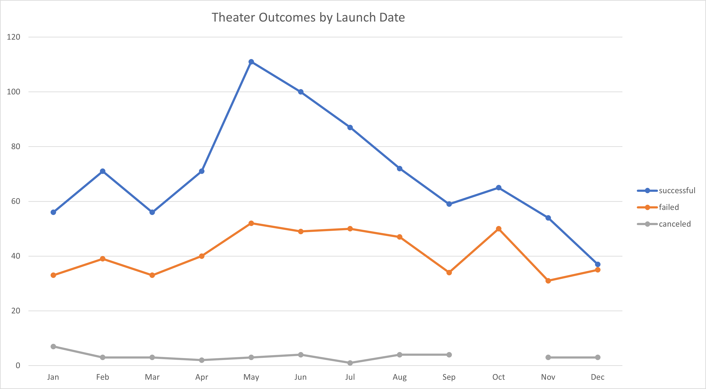
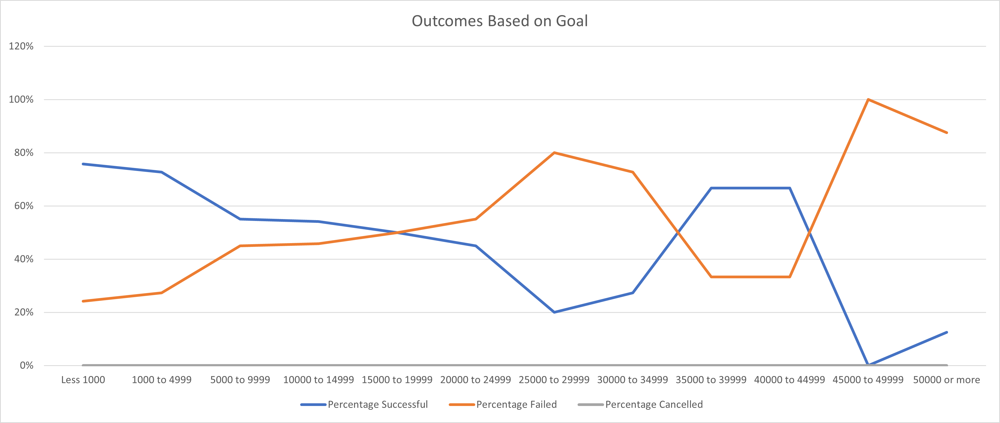

# Kickstarting with Excel

## Overview of Project
For our fictitious client "Louise," this project looks into a dataset of kickstarter campaigns usimg excel to help her understand what might make a campaign more successful.
### Purpose
"Louise" wants to learn how to increase the likelihood of success when she launches a kickstarter campaign for her new play "Fever." We will examine and draw some preliminary conclusions regarding the potential effects of launch data and the establishment of monitary goals on the success of campaigns for theatrical plays.
## Analysis and Challenges
The first few rows of our initial raw data set are shown in the screenshot below:

It consists of 4113 row contaigning campaign data and major categories.

To make analysis easier, Category and Subcategory column was seperated for better filtering. Furthermore, date format was represented in Unix timestamp, so we convert it to a more easily human readable format (MM/DD/YYYY for US user).
### Analysis of Outcomes Based on Launch Date

We observe a general pattern of increased success in the spring, which reaches its peak in May and continues to decline throughout the year, with the campaign season's lowest point beginning in December.

There does not appear to be a correlation between launch date and cancellations.
### Analysis of Outcomes Based on Goals

We observe a higher success rate of theeatrical play campaigns with lower fundraising objectives. Between goals of $15000 and $20000, the success rate begins to reverse, with failure being more common than success. Another inversion is observed between $35000 to $45000, reason for which is unkown and should be looked further into.
### Challenges and Difficulties Encountered
Some campaigns didn't have any backers which resulted in zero errors when using those values in calculations. This was resolved using conditional statements.
Other minor difficulties such as combined Category and Subcategory column and Unix timestamps have been discussed in previous sections.
## Results
Favourable time for Louise to start her campaign is in the spring (April-May). Avoid starting in December or January.

Louise's success rate will rise if the goal amount is decreased.
### Limitations
The given dataset is not latest (2011-2017). In 2016 and 2017, amount of campaigns greatly increased. Having more up-to-date will help us give more accurate predictions and help solidify conclusions.

United States of America is a huge and diverse nation. Additional geographic breakdowns may provide Louise with additional information that will help her make a decision.

A qualitative aspect of the play's theme is another limitation. Are certain topics more appealing than others? This particular aspect is ignored by this analysis.
### Areas to Explore
Instead of a success/failure analysis, we might want to investigate the relative rate of success as a ratio of total funding to the goal.

Explore duration of campaign's effect on success rate. 
